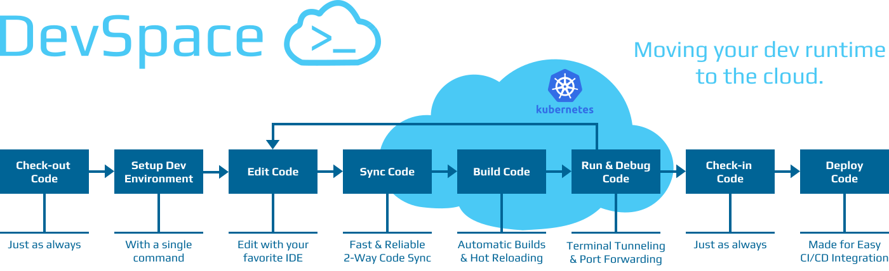
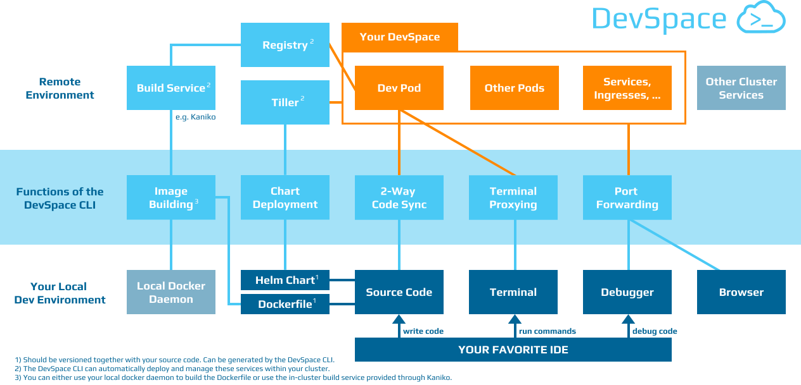

# DevSpace - Cloud Native Development with Kubernetes
[](https://travis-ci.org/covexo/devspace)
[](https://goreportcard.com/report/github.com/covexo/devspace)
[](http://slack.devspace-cloud.com/)
[](https://twitter.com/home?status=Just%20found%20out%20about%20%23DevSpace%20CLI%3A%20https%3A//github.com/covexo/devspace%0A%0AIt%20lets%20you%20build%20cloud%20native%20software%20directly%20on%20top%20of%20%23Kubernetes%20and%20%23Docker%0A%23CloudNative%20%23k8s)

With a DevSpace, you can build, test and run **code directly inside any Kubernetes cluster**. You can run `devspace up` in any of your projects and the client-only DevSpace CLI will start a DevSpace within your Kubernetes cluster. Keep coding as usual and the DevSpace CLI will sync any code change directly into the containers of your DevSpace. 

**No more waiting** for re-building images, re-deploying containers and restarting applications on every source code change. Simply edit your code with any IDE and run your code instantly inside your DevSpace.

## Why use a DevSpace?
Program inside any Kubernetes cluster (e.g. minikube, self-hosted or cloud platform) and:
- iterate quickly: no more building and pushing images on every change, use **hot reloading** instead (e.g. with nodemon)
- keep your existing workflow and tools: **the DevSpace CLI works with every IDE** (no plugins required)
- access cluster-internal services and data during development
- debug efficiently with port forwarding and terminal proxying
- migrate to Docker & Kubernetes within minutes

## Demo
This demo shows how to run `devspace up` directly from the terminal inside Visual Studio Code. However, the DevSpace CLI is not a plugin and will work with any terminal. In this example, we are starting a DevSpace for a React application.


## [Quickstart](https://devspace-cloud.com/getting-started/)
Follow this link for the [Quickstart Guide](https://devspace-cloud.com/getting-started/).

The DevSpace CLI allows you to create a DevSpace for any existing project with just a single command:
```
devspace up
```
Take a look at the [Getting Started Guide](https://devspace-cloud.com/getting-started/) to see how to get started with a DevSpace.

**Note:** Don't worry, you can use `devspace reset` to reset your project and go back to local development.

## [Installation](https://devspace.covexo.com/docs/getting-started/installation.html)
These commands will install the DevSpace CLI and add it to the PATH environment variable. For more details, see: [Getting Started](https://devspace-cloud.com/getting-started/)

### For Windows
1. Open Powershell with **admin rights**.
2. Run this install script:
```powershell
[System.Net.ServicePointManager]::SecurityProtocol = [System.Net.SecurityProtocolType]'Tls,Tls11,Tls12'
mkdir "$Env:Programfiles\devspace"
wget ((Invoke-WebRequest -URI "https://api.github.com/repos/covexo/devspace/releases/latest").Content -replace ".*`"(https://github.com[^`"]*devspace-windows-amd64.exe)`".*","`$1") -o $Env:Programfiles\devspace\devspace.exe
& "$Env:Programfiles\devspace\devspace.exe" "install"
```

**Note:** After running the install script, you should close and re-open your terminal window or IDE to refresh the environment variables.

### For Linux
```bash
curl -s -H "Accept: application/json" "https://api.github.com/repos/covexo/devspace/releases/latest" | sed -nE 's!.*"(https://github.com[^"]*devspace-linux-amd64)".*!\1!p' | xargs -n 1 curl -L -o devspace && chmod +x devspace && sudo mv devspace /usr/local/bin
```

### For Mac
```bash
curl -s -H "Accept: application/json" "https://api.github.com/repos/covexo/devspace/releases/latest" | sed -nE 's!.*"(https://github.com[^"]*devspace-darwin-amd64)".*!\1!p' | xargs -n 1 curl -L -o devspace && chmod +x devspace && sudo mv devspace /usr/local/bin
```

## [Documentation](https://devspace.covexo.com/docs/getting-started/quickstart.html)
Here you can find some links to the most important pages of our documentation:
- [Getting Started Guide](https://devspace-cloud.com/getting-started/)
- [Frequently Asked Questions (FAQ)](https://devspace.covexo.com/docs/getting-started/faq.html)
- [DevSpace Configuration Options](https://devspace.covexo.com/docs/configuration/config.yaml.html)
- [CLI Documentation](https://devspace.covexo.com/docs/cli/init.html)
- [Architecture Documentation](https://devspace.covexo.com/docs/advanced/architecture.html)

## [Architecture](https://devspace.covexo.com/docs/advanced/architecture.html)
Architecturally, the DevSpace CLI is a client-side software that interacts with services within your Kubernetes cluster. While the DevSpace CLI can deploy required services (e.g. image registry, Tiller server, Kaniko build pods) automatically, you can also configure it to use already deployed or externally hosted services.



For a more detailed description of the internals of the DevSpace CLI, take a look at the [Architecture Documentation](https://devspace.covexo.com/docs/advanced/architecture.html).

**Note:** Any interaction between your local computer and your DevSpace is passed through your Kubernetes API server, so you should ensure that your API server is protected with a suitable configuration for using TLS.

## [Contributing](CONTRIBUTING.md)
As any open source projects, we are looking forward to your contributions.

### Reporting Issues
If you find a bug while working with the DevSpace CLI, please [open an issue on GitHub](https://github.com/covexo/devspace/issues/new?labels=kind%2Fbug&template=bug-report.md&title=Bug:) and let us know what went wrong. We will try to fix it as quickly as we can.

### Feedback & Feature Requests
You are more than welcome to open issues in this project to:
- [give feedback](https://github.com/covexo/devspace/issues/new?labels=kind%2Ffeedback&title=Feedback:)
- [suggest new features](https://github.com/covexo/devspace/issues/new?labels=kind%2Ffeature&template=feature-request.md&title=Feature%20Request:)
- [ask a question](https://github.com/covexo/devspace/issues/new?labels=kind%2Fquestion&title=Question:)

### Contributing Code
This project is mainly written in Golang. To contribute code,
1. Check-out the project: `git clone https://github.com/covexo/devspace && cd devspace`
2. Install the dependencies: `dep ensure -v` (requires [Installing Dep](https://golang.github.io/dep/docs/installation.html))
3. Make changes to the code (add new dependencies to the Gopkg.toml)
4. Build the project, e.g. via `go build -o devspace.exe`

## License
You can use the DevSpace CLI for any private or commercial projects because it is licensed under the Apache 2.0 open source license.
