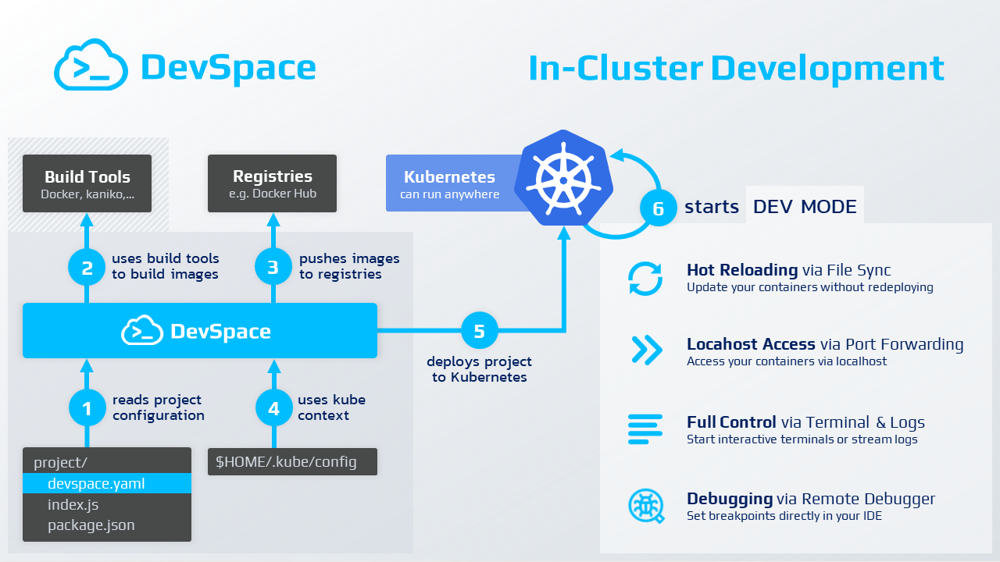
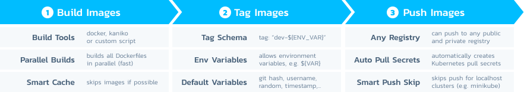
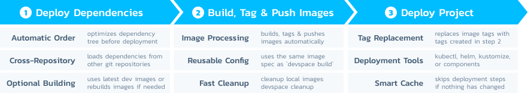
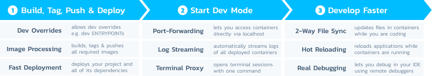

### **[Website](https://devspace.sh)** • **[Quickstart](#quickstart)** • **[Examples](#configuration-examples)** • **[Documentation](https://devspace.cloud/docs)** • **[Blog](https://devspace.cloud/blog)** • **[Slack](https://devspace.cloud/slack)** • **[Twitter](https://twitter.com/devspace)**


<br>


### Client-Only Developer Tool for Cloud-Native Development with Kubernetes
- **Build, test and debug applications directly inside Kubernetes**
- **Develop with hot reloading**: updates your running containers without rebuilding images or restarting containers
- **Unify deployment workflows** within your team and across dev, staging and production
- **Automate repetitive tasks** for image building and deployment

<br>

[](https://devspace.sh)


<br>

<p align="center">
⭐️ <strong>Do you like DevSpace? Support the project with a star</strong> ⭐️
</p>


<br>

## Contents
- [Why DevSpace?](#why-devspace)
- [Features](#features)
- [Architecture & Workflow](#architecture--workflow)
- [Quickstart Guide](#quickstart)
- [Config Examples](#configuration-examples)
- [Troubleshooting](#troubleshooting)
- [Contributing](#contributing)
- [FAQ](#faq)

<br>

## Why DevSpace?
Building modern, distributed and highly scalable microservices with Kubernetes is hard - and it is even harder for large teams of developers. DevSpace is the next-generation tool for fast cloud-native software development.

<details>
<summary><b>Standardize & Version Your Workflows</b></summary>
<br>

DevSpace allows you to store all your workflows in one declarative config file: `devspace.yaml`
- **Codify workflow knowledge** about building images, deploying your project and its dependencies etc.
- **Version your workflows together with your code** (i.e. you can get any old version up and running with just a single command) 
- **Share your workflows** with your team mates

<br>
</details>

<details>
<summary><b>Let Everyone on Your Team Deploy to Kubernetes</b></summary>
<br>

DevSpace helps your team to standardize deployment and development workflows without requiring everyone on your team to become a Kubernetes expert.
- The DevOps and Kubernetes expert on your team can configure DevSpace using `devspace.yaml` and simply commits it via git
- If other developers on your team check out the project, they only need to run `devspace deploy` to deploy the project (including image building and deployment of other related project etc.) and they have a running instance of the project
- The configuration of DevSpace is highly dynamic, so you can configure everything using [config variables](https://devspace.cloud/docs/cli/configuration/variables) that make it much easier to have one base configuration but still allow differences among developers (e.g. different sub-domains for testing)

> Giving everyone on your team on-demand access to a Kubernetes cluster is a challenging problem for system administrators and infrastructure managers. DevSpace Cloud, an optional add-on for DevSpace, makes sharing dev clusters much easier and safer. [Learn more about DevSpace Cloud](https://devspace.cloud/docs/cloud/what-is-devspace-cloud). 

<br>
</details>

<details>
<summary><b>Speed Up Cloud-Native Development</b></summary>
<br>

Instead of rebuilding images and redeploying containers, DevSpace allows you to **hot reload running containers while you are coding**:
- Simply edit your files with your IDE and see how your application reloads within the running container.
- The **high performance, bi-directional file synchronization** detects code changes immediately and synchronizes files immediately between your local dev environment and the containers running in Kubernetes
- Stream logs, connect debuggers or open a container terminal directly from your IDE with just a single command.

<br>
</details>

<details>
<summary><b>Automate Repetitive Tasks</b></summary>
<br>

Deploying and debugging services with Kubernetes requires a lot of knowledge and forces you to repeatedly run commands like `kubectl get po` and copy pod ids back and forth. Stop wasting time and let DevSpace automate the tedious parts of working with Kubernetes:
- DevSpace lets you build multiple images in parallel, tag them automatically and and deploy your entire application (including its dependencies) with just a single command
- Let DevSpace automatically start port-fowarding and log streaming, so you don't have to constantly copy and paste pod ids or run 10 commands to get everything started.

<br>
</details>

<details>
<summary><b>Works with Any Kubernetes Clusters</b></summary>
<br>

DevSpace is battle tested with many Kubernetes distributions including:
- **local Kubernetes clusters** like minikube, k3s, MikroK8s, kind
- **managed Kubernetes clusters** in GKE (Google Cloud), EKS (Amazon Web Service), AKS (Microsoft Azure), Digital Ocean
- **self-managed Kubernetes clusters** created with Rancher

> DevSpace also lets you switch seamlessly between clusters and namespaces. You can work with a local cluster as long as that is sufficient. If things get more advanced, you need cloud power like GPUs or you simply want to share a complex system such as Kafka with your team, simply tell DevSpace to use a remote cluster by switching your kube-context and continue working.

<br>
</details>

<br>


## Architecture & Workflow


DevSpace runs as a single binary CLI tool directly on your computer and ideally, you use it straight from the terminal within your IDE. DevSpace does not require a server-side component as it communicates directly to your Kubernetes cluster using your kube-context, just like kubectl.

<br>

## Features

Stop wasting time for running the same build and deploy commands over and over again. Let DevSpace automate your workflow and build cloud-native applications directly inside Kubernetes.


<details>
<summary><b>Automated Image Building with <code>devspace build</code></b></summary>
<br>

- **Customizable Build Process** supporting Docker, kaniko or even custom scripts
- **Parallel Image Building** to save time when multiple Dockerfiles have to be built  
- **Automatic Image Tagging** according to custom tag schema (e.g. using timestamp, commit hash or random strings)  
- **Automatic Push** to any public or private Docker registry (authorization via `docker login my-registry.tld`)  
- **Automatic Configuration of Pull Secrets** within the Kubernetes cluster
- **Smart Caching** that skips images which do not need to be rebuilt

</details>

[](https://devspace.cloud/docs/cli/image-building/workflow-basics)

<details>
<summary><b>Automated Deployment with <code>devspace deploy</code></b></summary>
<br>

- **Automatig Image Building** for images required in the deployment process
- **Customizable Deployment Process** supporting kubectl, helm, kustomize and more
- **Multi-Step Deployments** to deploy multiple application components (e.g. 1. webserver, 2. database, 3. cache)
- **Efficient Microservice Deployments** by defining dependencies between projects (even across git repositories)
- **Smart Caching** that skips deployments which do not need to be redeployed
- **Easy Integration into CI/CD Tools** with non-interactive mode

</details>

[](https://devspace.cloud/docs/cli/deployment/workflow-basics)

<details>
<summary><b>Efficient In-Cluster Development with <code>devspace dev</code></b></summary>
<br>

- **Hot Reloading** that updates your running containers without restarting them (whenever you change a line of code)
- **Fast + Reliable File Synchronization** to keep all files in sync between your local workspace and your containers
- **Port Forwarding** that lets you access services and pods on localhost and allows you to attach debuggers with ease
- **Multi-Container Log Streaming** that lets you stream the logs of multiple containers at once (+ color-coded prefix)
- **Terminal Proxy** that opens automatically and lets you run commands in your pods directly from your IDE terminal

</details>

[](https://devspace.cloud/docs/cli/development/workflow-basics)


<details>
<summary><b>Feature-Rich Localhost UI with <code>devspace ui</code></b></summary>
<br>

- **Graphical UI** for streaming logs, opening interactive terminals, starting port-forwarding and more
- **Runs 100% on localhost**: uses current kube-context, no server-side installation required


<br>

</details>


<details>
<summary><b>Convenience Commands for Kubernetes</b></summary>
<br>

- **Quick Pod Selection** eliminates the need to copy & paste pod names, namespaces etc.  
  &raquo; Shows a "dropdown selector" for pods directly in the CLI when running one of these commands:
  - `devspace enter` to open a **Interactive Terminal Session**
  - `devspace logs` / `devspace logs -f` for **Fast, Real-Time Logs** (optionally streaming new logs)
  - `devspace sync` for quickly starting a **Bi-Directional, Real-Time File Synchronization** on demand 
- **Automatic Issue Analysis** via `devspace analyze` reporting crashed containers, missing endpoints, scheduling errors, ...
- **Fast Deletion of Deployments** using `devspace purge` (deletes all helm charts, manifests etc. defined in the config)
- **Context Management** via:
  - `devspace use context` shows a list of contexts (select to set current kube-context)
  - `devspace use namespace` shows a list of namespaces (select to set defaut namespace for current context)
  - `devspace remove context` shows a list of contexts (select to remove a kube-context)

<br>
</details>


<details>
<summary><b>Powerful Configuration</b></summary>
<br>

- **Declarative Configuration File** that can be versioned and shared just like the source code of your project (e.g. via git)
- **Config Variables** which allow you to parameterize the config and share a unified config file with your team
- **Config Overrides** for overriding Dockerfiles or ENTRYPOINTs (e.g. to separate development, staging and production)
- **Hooks** for executing custom commands before or after each build and deployment step
- **Multiple Configs** for advanced deployment scenarios

<br>
</details>


<details>
<summary><b>Lightweight & Easy to Setup</b></summary>
<br>

- **Client-Only Binary** (server-side [DevSpace Cloud](https://devspace.cloud/docs/cloud/what-is-devspace-cloud) is optional for visual UI and team management)
- **Standalone Executable for all platforms** with no external dependencies and *fully written in Golang*
- **Automatic Config Generation** from existing Dockerfiles, Helm chart or Kubernetes manifests (optional)
- **Automatic Dockerfile Generation** (optional)

<br>
</details>


<details>
<summary><b>DevSpace Cloud: Server-Side Add-On (optional)</b></summary>
<br>

- **On-Demand Namespace Creation & Isolation** with automatic RBAC, network policies, pod security policies etc.
- **Graphical UI** for managing clusters, cluster users and user permissions (resource limits etc.)
- **Advanced Permission System** that automatically enforces user limits via resource quotas, adminission controllers etc.
- **Fully Automatic Context Configuration** on the machines of all cluster users with secure access token handling
- **100% Pure Kubernetes** and nothing else! Works with any Kubernetes cluster.
  
**More info and install intructions for DevSpace Cloud on: [www.github.com/devspace-cloud/devspace-cloud](https://github.com/devspace-cloud/devspace-cloud)**

</details>


<br>


## Quickstart

### 1. Install DevSpace

<details>
<summary>via NPM</summary>

```
npm install -g devspace
```

</details>

<details>
<summary>via Mac Terminal</summary>

```
curl -s -L "https://github.com/devspace-cloud/devspace/releases/latest" | sed -nE 's!.*"([^"]*devspace-darwin-amd64)".*!https://github.com\1!p' | xargs -n 1 curl -L -o devspace && chmod +x devspace;
sudo mv devspace /usr/local/bin;
```

</details>

<details>
<summary>via Linux Bash</summary>

```
curl -s -L "https://github.com/devspace-cloud/devspace/releases/latest" | sed -nE 's!.*"([^"]*devspace-linux-amd64)".*!https://github.com\1!p' | xargs -n 1 curl -L -o devspace && chmod +x devspace;
sudo install devspace /usr/local/bin
```

</details>

<details>
<summary>via Windows Powershell</summary>

```
md -Force "$Env:APPDATA\devspace"; [System.Net.ServicePointManager]::SecurityProtocol = [System.Net.SecurityProtocolType]'Tls,Tls11,Tls12';
Invoke-WebRequest -UseBasicParsing ((Invoke-WebRequest -URI "https://github.com/devspace-cloud/devspace/releases/latest" -UseBasicParsing).Content -replace "(?ms).*`"([^`"]*devspace-windows-amd64.exe)`".*","https://github.com/`$1") -o $Env:APPDATA\devspace\devspace.exe;
$env:Path += ";" + $Env:APPDATA + "\devspace";
[Environment]::SetEnvironmentVariable("Path", $env:Path, [System.EnvironmentVariableTarget]::User);
```

> If you get the error that Windows cannot find DevSpace after installing it, you will need to restart your computer, so that the changes to the `PATH` variable will be applied.

</details>

<br>

### 2. Choose a Project

| Project | Command                                     |
| ------- | --------------------------------------------------------------------------------------- |
| Node.js | `git clone https://github.com/devspace-cloud/quickstart-nodejs && cd quickstart-nodejs` |
| Python  | `git clone https://github.com/devspace-cloud/quickstart-python && cd quickstart-python` |
| Golang  | `git clone https://github.com/devspace-cloud/quickstart-golang && cd quickstart-golang` |
| PHP     | `git clone https://github.com/devspace-cloud/quickstart-php && cd quickstart-php`       |
| Ruby    | `git clone https://github.com/devspace-cloud/quickstart-ruby && cd quickstart-ruby`     |


<details>
<summary>Want to use DevSpace with your own project?</summary>

```bash
cd /path/to/my/project/root
```

> If you are using DevSpace for the first time, we recommend to get started with one of the demo projects listed above.

</details>


<br>

### 3. Initialize Your Project
Initializing a project will create the configuration file `devspace.yaml` which tells DevSpace how to deploy your project.
```bash
devspace init
```
> Take a look at the [Configuration Examples](#configuration-examples) to learn more about `devspace.yaml`

<br>

### 4. Choose a Kubernetes Cluster
Choose the cluster, you want to deploy your project to. If you are not sure, pick the first option. It is very easy to switch between the options later on.
<br>

<details>
<summary><b>Hosted Spaces sponsored by DevSpace (managed Kubernetes namespaces)</b>
<br>&nbsp;&nbsp;&nbsp;
<i>
FREE for one project, includes 1 GB RAM
</i>
</summary>

<br>

```bash
devspace create space my-app # requires login via GitHub or email
```
> DevSpace automatically sets up a kube-context for this space, so you can also access your isolated namespace using `kubectl`, `helm` or any other Kubernetes tool.

</details>

<br>

<details>
<summary><b>Your own local cluster</b>
<br>&nbsp;&nbsp;&nbsp;
<i>
works with any local Kubernetes cluster (minikube, kind, k3s, mikrok8s etc.)
</i>
</summary>

<br>

If you want to deploy to a local Kubernetes cluster, make sure your **current kube-context** points to this cluster and tell DevSpace which namespace to use:

```bash
# Tell DevSpace which namespace to use (will be created automatically during deployment)
devspace use namespace my-namespace
```

</details>

<br>

<details>
<summary><b>Your own remote cluster</b>
<br>&nbsp;&nbsp;&nbsp;
<i>
works with any remote Kubernetes cluster (GKE, EKS, AKS, bare metal etc.)
</i>
</summary>


#### Option A: You want to use this cluster alone
If you want to deploy to a remote Kubernetes cluster, make sure your **current kube-context** points to this cluster and tell DevSpace which namespace to use:
```bash
# Tell DevSpace which namespace to use (will be created automatically during deployment)
devspace use namespace my-namespace
```

#### Option B: You want to share this cluster with your team
To share a cluster, connect it to [DevSpace Cloud](https://devspace.cloud/docs/cloud/what-is-devspace-cloud) and then create an isolated Kubernetes namespace.
```bash
# Connect your cluster to DevSpace Cloud
devspace connect cluster # requires login via GitHub or email

# Create an isolated Kubernetes namespace in your cluster via DevSpace Cloud
devspace create space my-namespace
```

> DevSpace automatically sets up a kube-context for every space you create, so you can also access your isolated namespace using `kubectl`, `helm` or any other Kubernetes tool.

<br>

<details>
  <summary><b>What is DevSpace Cloud?</b></summary>

[DevSpace Cloud](https://devspace.cloud/docs/cloud/what-is-devspace-cloud) is the optional server-side component for DevSpace that allows you to connect any Kubernetes cluster and then share it with your team for development. DevSpace Cloud lets developers create isolated Kubernetes namespaces on-demand and makes sure that developers cannot break out of their namespaces by configuring RBAC, network & pod security policies etc.

> You can either
> - use the fully managed **[SaaS edition of DevSpace Cloud](https://app.devspace.cloud)**
> - or run it on your clusters using the **[on-premise edition available on GitHub](https://github.com/devspace-cloud/devspace-cloud)**.

<br>
</details>

<details>
  <summary><b>How are Spaces isolated? Why is it safe to share a cluster?</b></summary>

DevSpace Cloud makes sure that developers cannot break out of their namespaces by configuring RBAC, network policies, pod security policies etc. By default, these restrictions are very strict and do not even allow pods from different namespaces to communicate with eather other. You can configure every security setting that DevSpace Cloud enforces using the UI of DevSpace Cloud and even set custom limits for different members of your team.

<br>
</details>

<details>
  <summary><b>How can I add my team mates, so we can share this cluster?</b></summary>

1. Connect your cluster to DevSpace Cloud using `devspace connect cluster`
2. Go to **Clusters** in the UI of DevSpace Cloud: [https://app.devspace.cloud/clusters](https://app.devspace.cloud/clusters)
3. Click on your cluster
4. Go to the **Invites** tab
5. Click on the **Add Invite** button
6. Click on the invite link in the table and send the link to a team mate
7. After clicking on the link and defining an encryption key, your team mate will be able to create isolated namespaces.

<br>
</details>

<details>
  <summary><b>It it safe to connect my cluster to DevSpace Cloud?</b></summary>

**Yes**. When connecting a cluster to DevSpace Cloud, the CLI tool asks you to define an encrytion key. The cluster access token that the CLI creates will be encrypted with a hashed version of this key before sending it to DevSpace Cloud. That makes sure that no one can access your cluster except you. This key is hashed and stored on your local computer. That means that:

- If you use DevSpace from a different computer, you will have to enter the encryption key again or re-connect the cluster which generates a new access token and encrypts it with a new key.
- If you add a team member, you will have to send them a secure invite link which makes sure that they also get cluster access. This procedure is very safe and your key is never sent to our platform. After clicking on the invite link, your colleagues will define a separate encryption key for secure access to their namespaces.

> If you are still hesitant, you can run DevSpace Cloud in your own Kubernetes cluster using the on-premise edition: [https://github.com/devspace-cloud/devspace-cloud](https://github.com/devspace-cloud/devspace-cloud)

<br>
</details>

<details>
  <summary><b>Can I run DevSpace Cloud on-premise in my own cluster?</b></summary>
  
  **Yes**. Follow these intructions to run DevSpace Cloud yourself:

  **1. Install DevSpace Cloud**  
  &nbsp;&nbsp;&nbsp;
  See [www.github.com/devspace-cloud/devspace-cloud](https://github.com/devspace-cloud/devspace-cloud) for instructions.

  **2. Tell DevSpace to use your self-hosted DevSpace Cloud**  
```bash
devspace use provider devspace.my-domain.com
```

  **3. Connect a Kubernetes cluster to your self-hosted DevSpace Cloud**  
```bash
devspace connect cluster
```

  **4. Create an isolated namespace**  
```bash
devspace create space my-app
```

  </details>


</details>

<br>

### 5. Deploy
Initializing a project will create the configuration file `devspace.yaml` which tells DevSpace how to deploy your project.
```bash
devspace deploy
```

> **Having issues?** Take a look at the **[Troubleshooting Guides](#troubleshooting)** and learn how to fix common issues.

<br>

### 6. Open In Your Browser
You can now open your application in the browser using the following command:
```bash
devspace open
```
When DevSpace asks you how to open your application, choose the first option **"via localhost"** because it will work no matter what cluster you are using.

> If you want to connect a domain, check out our guide on [how to connect a domain by creating an ingress with DevSpace](https://devspace.cloud/docs/cli/guides/domains-ingresses).

**Congratulations!** You just deployed your first project to Kubernetes using DevSpace.


<br>

### 7. Develop
After successfully deploying your project one, you can start it in development mode and directly code within your Kubernetes cluster using terminal proxy, port forwarding and real-time code synchronization.

```bash
devspace dev
```
You can now:
- Access your application via `http://localhost:PORT` in your browser
- Edit your source code files and DevSpace will automatically synchronize them to the containers running in Kubernetes 
- Use a hot reloading tool like `nodemon` and your application will automatically reload when you edit source code files

Quickstart projects work out of the box in development mode because the `ENTRYPOINT` of the provided Dockerfiles start the projects in hot reloading mode. If you want to configure your own application to work well with `devspace dev`, it is highly recommended that you take a look at the documentation, to understand the [workflow and basics of the developing cloud-native software with DevSpace](https://devspace.cloud/docs/cli/development/workflow-basics).

> Run `devspace dev -i` to use interactive mode: overrides your Dockerfile `ENTRYPOINT` with `[sleep, 999999]` and opens the terminal proxy, so you can manually run the start command for your application, e.g. `npm start`. Interactive mode is great for debugging containers that keep crashing or starting an application in hot reloading mode when the Dockerfile ENTRYPOINT generally starts a rather production-like version of the application.

<br>

### 8. Open The Development UI
When running `devspace dev`, DevSpace starts a client-only UI for Kubernetes. You can see that in the output of `devspace dev` which should contain a log line similar to this one:
```bash
#########################################################
[info]   DevSpace UI available at: http://localhost:8090
#########################################################
```
By default, DevSpace starts the development UI on port `8090` but if the port is already in use, it will use a different port.

You can access the development UI once you:
- open the link from your `devspace dev` logs in the browser, e.g. [http://localhost:8090](http://localhost:8090)
- run the command `devspace ui` (e.g. in a separate terminal parallel to `devspace dev`)

Once the UI is open in your browser, it will look similar to this screenshot:


[Follow this guide to learn more about the functionalities of the DevSpace UI for Kubernetes development.](https://devspace.cloud/docs/cli/guides/localhost-ui)

<br>

### 9. Learn more
Follow these links to more about how to use DevSpace:
- [**DevSpace Tutorials**](https://devspace.cloud/docs/cli/guides/tutorials) (for different languages and frameworks)
- [How to use the Localhost UI of DevSpace](https://devspace.cloud/docs/cli/guides/localhost-ui)
- [How to connect a domain by creating an ingress](https://devspace.cloud/docs/cli/guides/domains-ingresses)
- [How to execute commands in your containers and start terminal sessions](https://devspace.cloud/docs/cli/guides/executing-commands)
- [How to synchronize files between your local computer and your containers](https://devspace.cloud/docs/cli/guides/file-synchronization)
- [How to configure differences between development, staging and production](https://devspace.cloud/docs/cli/guides/development-staging-production)
- [How to integrate DevSpace in your CI/CD pipeline](https://devspace.cloud/docs/cli/guides/ci-cd-integration)
- [How to troubleshoot common issues](https://devspace.cloud/docs/cli/guides/ci-cd-integration)

#### Useful Commands for Development

| Command&nbsp;&nbsp;&nbsp;&nbsp;&nbsp;&nbsp;&nbsp;&nbsp;&nbsp;&nbsp; | Important Flags / Notes |
| ------------------------------------------------------------------- | ---------------------------------------------------------------------------------------------------- |
| <a href="https://devspace.cloud/docs/cli/commands/devspace_dev">`devspace dev`</a><br> Starts the development mode    | `-b • Rebuild images (force)` <br> `-d • Redeploy everything (force)`  <br> `-i • Interactive mode (overrides ENTRYPOINT with [sleep, 999999] and starts interactive terminal session)`  |
| <a href="https://devspace.cloud/docs/cli/commands/devspace_ui">`devspace ui`</a><br> Opens the localhost development UI       |  |
| <a href="https://devspace.cloud/docs/cli/commands/devspace_open">`devspace open`</a><br> Opens your application after starting port-forwarding or generating an ingress   |   |
| <a href="https://devspace.cloud/docs/cli/commands/devspace_enter">`devspace enter`</a><br> Opens a terminal session for a container       |  |
| <a href="https://devspace.cloud/docs/cli/commands/devspace_enter">`devspace enter -- [command]`</a><br> Runs a command inside a container    |  |
| <a href="https://devspace.cloud/docs/cli/commands/devspace_logs">`devspace logs`</a> <br> Prints the logs of a container                 |  `-f • Stream logs (follow/attach)` |
| <a href="https://devspace.cloud/docs/cli/commands/devspace_analyze">`devspace analyze`</a> <br> Analyzes your namespace for issues        |  |
| <a href="https://devspace.cloud/docs/cli/commands/devspace_build">`devspace build`</a> <br> Build, tag and push images (no deploy) | `-t [TAG] • Use specified [TAG] to tag all images` |
| <a href="https://devspace.cloud/docs/cli/commands/devspace_cleanup_images">`devspace cleanup images`</a> <br> Deletes old images (locally, built by DevSpace) | <i>This is very useful after you built a lot of images and your local Docker daemon runs out of space (error: `no space left on device`) </i> |
| <a href="https://devspace.cloud/docs/cli/commands/devspace_attach">`devspace attach`</a> <br> Attaches to a running container | <i><a href="https://devspace.cloud/docs/cli/configuration/reference#deployments-componentcontainers">Requires `stdin` and `tty` to be `true`</a></i> |
| <a href="https://devspace.cloud/docs/cli/commands/devspace_attach">`devspace use space [NAME]`</a> <br> Switch into a different (existing) Space | <i>If you do not provide a `[NAME]`, DevSpace will show a selector with a list of all your Spaces.</i> |
| <a href="https://devspace.cloud/docs/cli/commands/devspace_attach">`devspace use namespace [NAME]`</a> <br> Switch to a different namespace | <i>If you do not provide a `[NAME]`, DevSpace will show a selector with a list of available namespaces.</i> |
| <a href="https://devspace.cloud/docs/cli/commands/devspace_attach">`devspace use context [NAME]`</a> <br> Switch to a different kube-context | <i>If you do not provide a `[NAME]`, DevSpace will show a selector with a list of available kube-contexts.</i> |

<br>


## Configuration Examples
You can configure DevSpace with the `devspace.yaml` configuration file that should be placed within the root directory of your project. The general structure of a `devspace.yaml` looks like this:

```yaml
# File: ./devspace.yaml
version: {config-version}

images:                 # DevSpace will build these images in parallel and push them to the respective registries
  {image-a}: ...        # tells DevSpace how to build image-a
  {image-b}: ...        # tells DevSpace how to build image-b
  ... 

deployments:            # DevSpace will deploy these [Helm charts | manifests | ... ] one after another
  - {deployment-1}      # could be a Helm chart
  - {deployment-2}      # could be a folder with kubectl manifests
  ...

dev:                    # Special config options for `devspace dev`
  ports: ...            # Configure port-forwarding
  open: ...             # Configure auto-open for opening URLs after starting development mode
  sync: ...             # Configure file synchronization
  logs: ...             # Configure multi-container log streaming
  autoReload: ...       # Tells DevSpace when to redeploy (e.g. when a manifest file has been edited)
  interactive: ...      # Customize Interactive Mode (devspace dev -i)

dependencies:           # Tells DevSpace which related projects should be deployed before deploying this project
  - {dependency-1}      # Could be another git repository
  - {dependency-2}      # Could point to a path on the local filesystem
  ...

vars:                   # Make your config dynamic and easier to share (ask a question if env var is not defined)
  - name: DOMAIN_NAME   # Will be used as ${DOMAIN_NAME} in config
    question: Which hostname should we use for the ingress?

profiles:               # Configure different profiles (e.g. dev, staging, prod, debug-backend)
  - name: debug-backend
    patches:            # Change the config with patches when this profile is active
      - op: replace
        path: images.default.entrypoint
        value: [npm, run, debug]

commands:               # Custom commands: define reusable commands and run them via: devspace run [command-name]
  - name: debug-backend # The best way to share your workflows with other team mates
    command: devspace dev -i --profile=debug-backend

hooks:                  # Customize all workflows using hooks
  - command: echo
    args:
      - "before image building"
    when:
      before:
        images: all
```

<details>
<summary>See an example of a devspace.yaml config file</summary>

```yaml
# File: ./devspace.yaml
version: v1beta2

images:
  backend:                              # Key 'backend' = Name of this image
    image: my-registry.tld/image1       # Registry and image name for pushing the image
    createPullSecret: true              # Let DevSpace automatically create pull secrets in your Kubernetes namespace

deployments:
- name: quickstart-nodejs               # Name of this deployment
  helm:                                 # Deploy using Helm
    chart:                              # Helm chart to be deployed
      name: component-chart             # DevSpace component chart is a general-purpose Helm chart
      version: v0.0.6
      repo: https://charts.devspace.cloud
    values:                             # Override Values for chart (van also be set using valuesFiles option)
      containers:                       # Deploy these containers with this general-purpose Helm chart
      - image: my-registry.tld/image1   # Image of this container
        resources:
          limits:
            cpu: "400m"                 # CPU limit for this container
            memory: "500Mi"             # Memory/RAM limit for this container
      service:                          # Expose this component with a Kubernetes service
        ports:                          # Array of container ports to expose through the service
        - port: 3000                    # Exposes container port 3000 on service port 3000
- name: database                        # A second deployment for a postgresql database
  helm:
    chart:
      name: stable/postgresql
    values:
      postgresqlDatabase: "db_website"
      postgresqlUsername: "db_user"
      postgresqlPassword: ${DB_PASSWORD}
      resources:
        requests:
          memory: 0
          cpu: 0

dev:
  ports:
    forward:
    - port: 3000
    - port: 8080
      remotePort: 80
    image: backend
  open:
  - url: http://localhost:3000/login
  sync:
  - localSubPath: ./src
    containerPath: .
    image: backend
  autoReload:
    paths:
    - ./manifests/**

dependencies:
- source:
    git: https://github.com/my-api-server
- source:
    path: ../my-auth-server
```

</details>

<br>

The following sections show code snippets with example sections of a `devspace.yaml` for certain use cases. 


### Configure Image Building

<details>
<summary>
Build images with Docker
</summary>

```yaml
# File: ./devspace.yaml
images:
  auth-server:
    image: dockerhub-username/my-auth-server    # Push to Docker Hub (no registry hostname required) => uses ./Dockerfile by default
    createPullSecret: true                      # Create a Kubernetes pull secret for this image before deploying anything
  webserver:
    image: dscr.io/username/my-webserver        # Push to private registry
    createPullSecret: true
    dockerfile: ./webserver/Dockerfile          # Build with --dockerfile=./webserver/Dockerfile
    context: ./webserver                        # Build with --context=./webserver
  database:
    image: another-registry.tld/my-image        # Push to another private registry
    createPullSecret: true
    dockerfile: ./db/Dockerfile                 # Build with --dockerfile=./db/Dockerfile
    context: ./db                               # Build with --context=./db
    # The following line defines a custom tag schema for this image (default tag schema is: ${DEVSPACE_RANDOM})
    tag: ${DEVSPACE_USERNAME}-devspace-${DEVSPACE_GIT_COMMIT}-${DEVSPACE_RANDOM}
```
Take a look at the documentation for more information about [configuring builds with Docker](https://devspace.cloud/docs/cli/image-building/configuration/build-tools#docker-default).  

</details>

<details>
<summary>
Build images with kaniko (inside a Kubernetes pod)
</summary>

```yaml
# File: ./devspace.yaml
images:
  auth-server:
    image: dockerhub-username/my-auth-server    # Push to Docker Hub (no registry hostname required) => uses ./Dockerfile by default
    build:
      kaniko:                                   # Build this image with kaniko
        cache: true                             # Enable caching
        insecure: false                         # Allow kaniko to push to an insecure registry (e.g. self-signed SSL certificate)
  webserver:
    image: dscr.io/username/my-webserver        # This image will be built using Docker with kaniko as fallback if Docker is not running
    createPullSecret: true
    dockerfile: ./webserver/Dockerfile          # Build with --dockerfile=./webserver/Dockerfile
    context: ./webserver                        # Build with --context=./webserver
```
Take a look at the documentation for more information about [building images with kaniko](https://devspace.cloud/docs/cli/image-building/configuration/build-tools#kaniko). 

</details>

<details>
<summary>
Build images with custom commands and scripts
</summary>

```yaml
# File: ./devspace.yaml
images:
  auth-server:
    image: dockerhub-username/my-auth-server    # Push to Docker Hub (no registry hostname required) => uses ./Dockerfile by default
    build:
      custom:
        command: "./scripts/builder"
        args: ["--some-flag", "flag-value"]
        imageFlag: "image"
        onChange: ["./Dockerfile"]
  webserver:
    image: dscr.io/username/my-webserver        # This image will be built using Docker with kaniko as fallback if Docker is not running
    createPullSecret: true
    dockerfile: ./webserver/Dockerfile          # Build with --dockerfile=./webserver/Dockerfile
    context: ./webserver                        # Build with --context=./webserver
```
Take a look at the documentation for more information about using [custom build scripts](https://devspace.cloud/docs/cli/image-building/configuration/build-tools#custom).  

</details>


### Configure Deployments

<details>
<summary>
Deploy components
</summary>

```yaml
# File: ./devspace.yaml
deployments:
- name: quickstart-nodejs
  helm:
    componentChart: true
    values:
      containers:
      - image: my-registry.tld/image1
        resources:
          limits:
            cpu: "400m"
            memory: "500Mi"
```
DevSpace allows you to [add predefined components](https://devspace.cloud/docs/cli/deployment/components/configuration/overview-specification#devspace-add-deployment-name-component-mysql-redis) using the `devspace add component [component-name]` command. 

Learn more about:
- [What are components?](https://devspace.cloud/docs/cli/deployment/components/what-are-components)
- [Configuring Components](https://devspace.cloud/docs/cli/deployment/components/configuration/overview-specification) 

 

</details>

<details>
<summary>
Deploy Helm charts
</summary>

```yaml
# File: ./devspace.yaml
deployments:
- name: default
  helm:
    chart:
      name: redis
      version: "6.1.4"
      repo: https://kubernetes-charts.storage.googleapis.com
```
Learn more about:
- [What are Helm charts?](https://devspace.cloud/docs/cli/deployment/helm-charts/what-are-helm-charts)
- [Configure Helm chart deployments](https://devspace.cloud/docs/cli/deployment/helm-charts/configuration/overview-specification)

 

</details>

<details>
<summary>
Deploy manifests with kubectl
</summary>

```yaml
# File: ./devspace.yaml
deployments:
- name: my-nodejs-app
  kubectl:
    manifests:
    - manifest-folder/
    - some-other-manifest.yaml
```
Learn more about:
- [What are Kubernetes manifests?](https://devspace.cloud/docs/cli/deployment/kubernetes-manifests/what-are-manifests)
- [Configure manifest deployments](https://devspace.cloud/docs/cli/deployment/kubernetes-manifests/configuration/overview-specification)


</details>

<details>
<summary>
Deploy manifests with kustomize
</summary>

```yaml
# File: ./devspace.yaml
deployments:
- name: my-deployment
  kubectl:
    manifests:
    - my-manifests/
    - more-manifests/
    kustomize: true
```
Take a look at the documentation for more information about [deploying manifests with kustomize](https://devspace.cloud/docs/cli/deployment/kubernetes-manifests/configuration/kustomize). 


</details>

<details>
<summary>
Define multiple deployments in one project
</summary>

```yaml
# File: ./devspace.yaml
deployments:
- name: my-deployment
  kubectl:
    manifests:
    - manifest-folder/
    - some-other-manifest.yaml
- name: my-cache
  helm:
    chart:
      name: redis
      version: "6.1.4"
      repo: https://kubernetes-charts.storage.googleapis.com
```

DevSpace processes all deployments of a project according to their order in the `devspace.yaml`. You can combine deployments of different types (e.g. Helm charts and manifests).

Take a look at the documentation to learn more about [how DevSpace deploys projects to Kubernetes](https://devspace.cloud/docs/cli/deployment/workflow-basics).  

</details>

<details>
<summary>
Define dependencies between projects (e.g. to deploy microservices)
</summary>

```yaml
# File: ./devspace.yaml
dependencies:
- source:
    git: https://github.com/my-api-server
- source:
    git: https:/my-private-git.tld/my-auth-server 
- source:
    path: ../my-auth-server
  config: default
```

Before deploying a project, DevSpace resolves all dependencies and builds a dependency tree which will then be deployed in a buttom-up fashion, i.e. the project which you call `devspace deploy` in will be deployed last.

Take a look at the documentation to learn more about [how DevSpace deploys dependencies of projects](https://devspace.cloud/docs/cli/deployment/advanced/dependencies).  

</details>


### Configure Development Mode

<details>
<summary>
Configure code synchronization
</summary>

```yaml
# File: ./devspace.yaml
dev:
  sync:
  - localSubPath: ./src # relative to the devspace.yaml
    # Start syncing to the containers current working directory (You can also use absolute paths)
    containerPath: .
    # This tells devspace to select pods that have the following labels
    labelSelector:
      app.kubernetes.io/component: default
      app.kubernetes.io/name: devspace-app
    # Only download changes to these paths, but do not upload any changes (.gitignore syntax)
    uploadExcludePaths:
    - node_modules/
    # Only upload changes to these paths, but do not download any changes (.gitignore syntax)
    downloadExcludePaths:
    - /app/tmp
    # Ignore these paths completely during synchronization (.gitignore syntax)
    excludePaths:
    - Dockerfile
    - logs/
```

The above example would configure the sync, so that:
- local path `./src` will be synchronized to the container's working directory `.` (specified in the Dockerfile)
- `./src/node_modules` would **not** be uploaded to the container

Take a look at the documentation to learn more about [configuring file synchronization during development](https://devspace.cloud/docs/cli/development/configuration/file-synchronization).  

</details>

<details>
<summary>
Redeploy instead of synchronizing code
</summary>

```yaml
# File: ./devspace.yaml
dev:
  autoReload:
    paths:
    - ./Dockerfile
    - ./manifests/**
```

This configuration would tell DevSpace to redeploy your project when the Dockerfile changes or any file within `./manifests`.

Take a look at the documentation to learn more about [configuring auto-reloading for development](https://devspace.cloud/docs/cli/development/configuration/auto-reloading).  

</details>


### Advanced Configuration

<details>
<summary>
Use config variables
</summary>

```yaml
# File: ./devspace.yaml
images:
  default:
    image: ${DEVSPACE_USERNAME}/image-name
    tag: ${DEVSPACE_GIT_COMMIT}-${DEVSPACE_TIMESTAMP}
```

DevSpace allows you to use certain pre-defined variables to make the configuration more flexible and easier to share with others. Additionally, you can add your own custom variables.

Take a look at the documentation to learn more about [using variables for dynamic configuration](https://devspace.cloud/docs/cli/configuration/variables).  

</details>

<details>
<summary>
Define config profiles and patches
</summary>

```yaml
# File: ./devspace-configs.yaml
images:
  backend:
    image: john/devbackend
  backend-debugger:
    image: john/debugger
deployments:
- name: app-backend
  component:
    containers:
    - image: john/devbackend
    - image: john/debugger
profiles:
- name: production
  patches:
  - op: replace
    path: images.backend.image
    value: john/prodbackend
  - op: remove
    path: deployments[0].component.containers[1]
  - op: add
    path: deployments[0].component.containers
    value:
      image: john/cache
```

DevSpace allows you to define different profiles for different use cases (e.g. working on different services in the same project, starting certain debugging enviroment) or for different deployment targets (e.g. dev, staging production).

You can tell DevSpace to switch permenantly to another profile using this command: `devspace use profile [config-name]`

Alternatively, you can temporarily use a different profile for running a single command using the `-p / --profile [NAME]` flag.

Take a look at the documentation to learn more about [using config profiles and patches](https://devspace.cloud/docs/cli/configuration/profiles-patches).  

</details>

<details>
<summary>
Define hooks
</summary>

```yaml
# File: ./devspace.yaml
hooks:
  - command: echo
    args:
      - "before image building"
    when:
      before:
        images: all
```

The command defined in this hook would be executed before building the images defined in the config.

Take a look at the documentation to learn more about [using hooks](https://devspace.cloud/docs/cli/configuration/hooks). 

</details>


<br>
<br>

## Troubleshooting

<details>
<summary>My application is not working</summary>

#### Problem
This problem can be caused by many different things.

#### Solution
There is no single solution for this but here are some steps to troubleshoot this problem:

##### 1. Let DevSpace analyze your deployment
Run this command within your project:
```
devspace analyze
```

##### 2. Check your Dockerfile
Make sure your Dockerfile works correctly. Use Google to find the best solutions for creating a Dockerfile for your application (often depends on the framework you are using). 

If your pods are crashing, you might have the wrong `ENTRYPOINT` or something is missing within your containers. A great way to debug this is to start the interactive development mode using:
```bash
devspace dev -i
```
With the interactive mode, DevSpace will override the `ENTRYPOINT` in our Dockerfile with `[sleep, 999999]` and open a terminal proxy. That means your containers will definitively start but only in sleep mode. After the terminal opens you can run the start command for your application yourself, e.g. `npm start`.

##### 3. Debug your application with kubectl
Run the following commands to find issues:
```bash
# Failing Pods
kubectl get po                  # Look for terminated, crashed or pending pods (restart > 1 is usually not good)
kubectl describe po [POD_NAME]  # Look at the crash reports Kubernetes provides

# Network issues
kubectl get svc                 # See if there is a service for your app
kubectl get ep                  # Make sure every service has endpoints (if not: make sure you are using the right ports in your devspace.yaml and make sure your pods are running)
kubectl get ing                 # Make sure there is an ingress for your app
```


</details>

<details>
<summary>DevSpace hangs at <code>[wait] Logging into cloud provider...</code></summary>

#### Problem
DevSpace tries to open a browser window, so you can login to DevSpace Cloud (either our SaaS platform or the self-hosted version that you installed in your cluster). If you are using a terminal inside a Docker container or VM, DevSpace is not able to open a browser window. You have two options to work around this:

#### Solution A
Run DevSpace on your local machine where you have a browser installed.

#### Solution B 
Generate an access key and login with the non-interactive login method. Follow these steps:
   1. Open this page: https://app.devspace.cloud/settings/access-keys (for on-premise version: https://[my-devspace-cloud-url]/settings/access-keys)
   2. Click on the button "Create Key".
   3. Enter a name (e.g. my-access-key).
   4. Click on "Create Access Key".
   5. Copy the access key displayed within the input field.
   6. Login via `devspace login --key=[YOUR_ACCESS_KEY]`
   7. Try the command again that you originally wanted to execute.


</details>

<details>
<summary>Cloud Authentication: <code>get token: Received invalid token from provider</code></summary>

#### Problem
This might happen when you are using an on-premise install of DevSpace Cloud and the VM of your Kubernetes cluster (e.g. Docker VM for Kubernetes in Docker Desktop) has the wrong date/time.

#### Solution
Make sure the VM of your local Kubernetes cluster has the correct date/time. For local clusters created with Docker Desktop, you can run the following script to fix the issue:
```bash
HOST_TIME=$(date -u +"%Y.%m.%d-%H:%M:%S");
docker run --net=host --ipc=host --uts=host --pid=host -it --security-opt=seccomp=unconfined --privileged --rm -v /:/docker-vm alpine /bin/sh -c "date -s $HOST_TIME"
```

</details>

<details>
<summary>Docker: <code>Error response from daemon: Get https://[registry]/v2/: x509: certificate has expired or is not yet valid</code></summary>

#### Problem
This might happen when you the VM of your Docker daemon has the wrong date/time.

#### Solution
Make sure the VM of your Docker daemon has the correct date/time. For Docker Desktop, you can run the following script to fix the issue:
```bash
HOST_TIME=$(date -u +"%Y.%m.%d-%H:%M:%S");
docker run --net=host --ipc=host --uts=host --pid=host -it --security-opt=seccomp=unconfined --privileged --rm -v /:/docker-vm alpine /bin/sh -c "date -s $HOST_TIME"
```

</details>


<br>
<br>

## Contributing

Help us make DevSpace the best tool for developing, deploying and debugging Kubernetes apps.

### Reporting Issues

If you find a bug while working with the DevSpace, please [open an issue on GitHub](https://github.com/devspace-cloud/devspace/issues/new?labels=kind%2Fbug&template=bug-report.md&title=Bug:) and let us know what went wrong. We will try to fix it as quickly as we can.

### Feedback & Feature Requests

You are more than welcome to open issues in this project to:

- [give feedback](https://github.com/devspace-cloud/devspace/issues/new?labels=kind%2Ffeedback&title=Feedback:)
- [suggest new features](https://github.com/devspace-cloud/devspace/issues/new?labels=kind%2Ffeature&template=feature-request.md&title=Feature%20Request:)
- [ask a question on Slack](https://devspace.cloud/slack)

### Contributing Code

This project is mainly written in Golang. If you want to contribute code:

1. Ensure you are running golang version 1.11.4 or greater for go module support
2. Set the following environment variables:
   ```
   GO111MODULE=on
   GOFLAGS=-mod=vendor
   ```
3. Check-out the project: `git clone https://github.com/devspace-cloud/devspace && cd devspace`
4. Make changes to the code
5. Build the project, e.g. via `go build -o devspace[.exe]`
6. Evaluate and test your changes `./devspace [SOME_COMMAND]`

See [Contributing Guideslines](CONTRIBUTING.md) for more information.

<br>

## FAQ

<details>
<summary>What is DevSpace?</summary>

DevSpace is an open-source command-line tool that provides everything you need to develop, deploy and debug applications with Docker and Kubernetes. It lets you streamline deployment workflows and share them with your colleagues through a declarative configuration file `devspace.yaml`.

</details>

<details>
<summary>Is DevSpace free?</summary>

**YES.** DevSpace is open-source and you can use it for free for any private projects and even for commercial projects.

</details>

<details>
<summary>What is DevSpace Cloud?</summary>

DevSpace Cloud extends DevSpace with a server-side component. It is entirely optional and meant for cluster admins that want to enable their developers to create isolated Kubernetes namespaces on-demand within a development cluster. DevSpace Cloud lets you easily manage cluster users, enforce resource limits and make sure developers can share a dev cluster without getting in the way of each other.

> Even when using DevSpace Cloud, DevSpace directly interacts with the Kubernetes cluster, so you code or commands will never go through DevSpace Cloud.

</details>

<details>
<summary>Is DevSpace Cloud free?</summary>

**YES.** DevSpace Cloud has a free tier depending on how you use it:
- You can use the SaaS edition and create 1 Hosted Space for free.
- You can use the SaaS edition and connect 1 Kubernetes cluster and add up to 3 developers to this cluster for free.
- You can install the on-premise edition and use it with up to 10 developers for free.

</details>

<details>
<summary>What is a Space?</summary>

Spaces are isolated Kubernetes namespaces which are managed by DevSpace Cloud and which provide the following features:

- Automatic provisioning via `devspace create space [SPACE_NAME]`
- Automatic allocation of a subdomain for each Space, e.g. `my-app.devspace.host`
- Automatic RBAC configuration for better isolation of users
- Automatic resource limit configuration and enforcement
- Dynamic resource auto-scaling within the configured limits

</details>

<details>
<summary>Do I need a Kubernetes cluster to use DevSpace?</summary>

**No.** You can simply use **the fully managed Hosted Spaces** provided by the SaaS version of DevSpace Cloud. You can create 1 Hosted Space for free.

</details>

<details>
<summary>Can I use DevSpace with my existing Kubernetes clusters?</summary>

**Yes.** You have multiple options:

1. Use DevSpace with your current kube-context (not using DevSpace Cloud at all).
2. Using the SaaS version of DevSpace Cloud and connect your existing Kubernetes clusters to DevSpace Cloud as external clusters (available soon). DevSpace Cloud will then be able to automatically manage cluster users and permissions. This lets you created isolated namespaces (Spaces) within your Kubernetes clusters.
3. Run DevSpace Cloud on-premise and connect your Kubernetes cluster to it in the same way you would use the SaaS version of DevSpace Cloud.

</details>

<details>
<summary>What is a Helm chart?</summary>

[Helm](https://helm.sh/) is the package manager for Kubernetes. Packages in Helm are called Helm charts. [Learn more about Helm charts.](https://devspace.cloud/docs/cli/deployment/helm-charts/what-are-helm-charts)

</details>

<br>
<br>

You can use the DevSpace for any private or commercial projects because it is licensed under the Apache 2.0 open source license.
